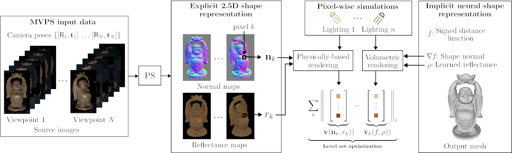

```markdown
# RNb-NeuS2

Welcome to the official CUDA implementation of **RNb-NeuS: Reflectance and Normal-based Multi-View 3D Reconstruction**.

## Authors

[Baptiste Brument](https://bbrument.github.io/),  
[Robin Bruneau](https://robinbruneau.github.io/),  
[Yvain Quéau](https://sites.google.com/view/yvainqueau),  
[Jean Mélou](https://www.irit.fr/~Jean.Melou/),  
[François Lauze](https://loutchoa.github.io/),  
[Jean-Denis Durou](https://www.irit.fr/~Jean-Denis.Durou/),  
[Lilian Calvet](https://scholar.google.com/citations?user=6JewdrMAAAAJ&hl=en)

### Resources

- [Project Page](https://robinbruneau.github.io/publications/rnb_neus.html)
- [Paper](https://arxiv.org/abs/2312.01215)



## Table of Contents

- [Gallery](#gallery)
- [Installation](#installation)
- [Training](#training)
- [Data](#data)
- [Data Convention](#data-convention)
- [Acknowledgements & Citation](#acknowledgements--citation)

## Installation

Follow the [Instant-NGP](https://github.com/NVlabs/instant-ngp#building-instant-ngp-windows--linux) instructions for requirements and compilation. [NeuS2](https://github.com/19reborn/NeuS2) installation steps are similar.

Clone the repository and its submodules:
```bash
git clone https://github.com/RobinBruneau/RNb_NeuS2/
cd RNb_NeuS2
```

Build the project using CMake:
```bash
cmake . -B build
cmake --build build --config RelWithDebInfo -j 
```

Ensure you have Python and the following libraries installed:
- Numpy
- Scipy
- Argparse
- Json
- Cv2
- Glob
- Shutil
- PyOctree
- Scipy

## Data Convention

Organize your data in the `./data/` folder following this structure:
```plaintext
./data/FOLDER/
    albedo/          # (Optional)
        000.png
        001.png
        002.png
    normal/          # (Mandatory)
        000.png
        001.png
        002.png
    mask/            # (Mandatory)
        000.png
        001.png
        002.png
    mask_normal_uncertainty/  # (Optional)
        000.png
        001.png
        002.png
    cameras.npz
```

## Data

We provide the [DiLiGenT-MV](https://drive.google.com/file/d/1TEBM6Dd7IwjRqJX0p8JwT9hLmy_vA5nU/view?usp=drive_link) dataset with normals and reflectance maps estimated using [SDM-UniPS](https://github.com/satoshi-ikehata/SDM-UniPS-CVPR2023/). Reflectance maps were scaled over all views, and uncertainty masks were generated from 100 normal estimations (see the paper for details).

## Training

### Preprocess the Data

```bash
python script/preprocess.py --folder ./data/<FOLDER>/ --exp_name <EXP_NAME>
```

### Run Optimization

```bash
./run.sh ./data/<FOLDER>/<EXP_NAME>
```

Results will be saved in `./data/<FOLDER>/<EXP_NAME>/`. Modify `run.sh` with the following options:

```plaintext
--scene FOLDER          # Path to your data
--maxiter INT           # Number of iterations
--mask-weight FLOAT     # Weight of the mask loss
--save-mesh             # Extract the mesh at the end
--save-snapshot         # Save the neural weights
--no-albedo             # Train only on normals
--resolution INT        # Resolution for marching cube (default 512)
--no-gui                # Run optimization without GUI
```

### Run Optimization with Scaled Reflectance Maps

For reflectance maps with varying scale factors, here's a script that generates a mesh without reflectance maps first, then uses this mesh to scale the reflectance maps. Finally, it generates a mesh using the scaled reflectance maps. 

```bash
./run_scaled_albedo.sh ./data/<FOLDER>/<EXP_NAME>
```
Results will be in `./data/<FOLDER>/<EXP_NAME>-albedoscaled/`.
Note: The provided DiLiGenT-MV dataset already has scaled reflectance maps in the `albedo` folder.

## Acknowledgements & Citation

- [RNb-NeuS](https://robinbruneau.github.io/publications/rnb_neus.html)

```bibtex
@inproceedings{Brument23,
    title={RNb-Neus: Reflectance and Normal Based Reconstruction with NeuS},
    author={Baptiste Brument and Robin Bruneau and Yvain Quéau and Jean Mélou and François Lauze and Jean-Denis Durou and Lilian Calvet},
    eprint={2312.01215},
    archivePrefix={arXiv},
    year={2023}
}
```

- [NeuS2](https://vcai.mpi-inf.mpg.de/projects/NeuS2/)

```bibtex
@inproceedings{neus2,
    title={NeuS2: Fast Learning of Neural Implicit Surfaces for Multi-view Reconstruction}, 
    author={Wang, Yiming and Han, Qin and Habermann, Marc and Daniilidis, Kostas and Theobalt, Christian and Liu, Lingjie},
    year={2023},
    booktitle={Proceedings of the IEEE/CVF International Conference on Computer Vision (ICCV)}
}
```

- [Instant-NGP](https://github.com/NVlabs/instant-ngp)

```bibtex
@article{mueller2022instant,
    author = {Thomas M\"uller and Alex Evans and Christoph Schied and Alexander Keller},
    title = {Instant Neural Graphics Primitives with a Multiresolution Hash Encoding},
    journal = {ACM Trans. Graph.},
    issue_date = {July 2022},
    volume = {41},
    number = {4},
    month = jul,
    year = {2022},
    pages = {102:1--102:15},
    articleno = {102},
    numpages = {15},
    url = {https://doi.org/10.1145/3528223.3530127},
    doi = {10.1145/3528223.3530127},
    publisher = {ACM},
    address = {New York, NY, USA},
}
```

- [NeuS](https://lingjie0206.github.io/papers/NeuS/)

```bibtex
@inproceedings{wang2021neus,
    title={NeuS: Learning Neural Implicit Surfaces by Volume Rendering for Multi-view Reconstruction},
    author={Wang, Peng and Liu, Lingjie and Liu, Yuan and Theobalt, Christian and Komura, Taku and Wang, Wenping},
    booktitle={Proc. Advances in Neural Information Processing Systems (NeurIPS)},
    volume={34},
    pages={27171--27183},
    year={2021}
}